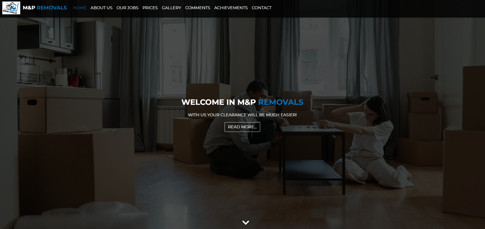
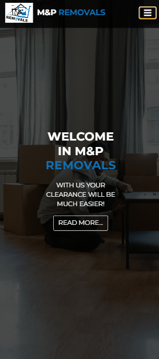

# M-P Removals Website 🚚

A responsive business website built with **HTML, CSS and JavaScript** for a removals and moving service company.

The project focuses on creating a clean, modern and professional landing page that presents company services and allows potential clients to quickly learn about the business.

---

# Live Demo

👉 https://sebastianjuszczynski.github.io/M-P-Removals---website/

---

# Preview




---

# Project Overview

This project was created to practice building a real-world business website using fundamental frontend technologies.

The goal was to create a clear and professional layout suitable for a service company, focusing on usability, responsive design and clean presentation of services.

During development I focused on:

- building a structured multi-section website
- creating a responsive layout
- designing a clean and modern UI
- organizing HTML, CSS and JavaScript files
- improving user navigation and accessibility

---

# Features

- Responsive business website layout
- Modern landing page design
- Service presentation sections
- Navigation menu
- Contact section
- Clean and simple UI
- Optimized structure for small business websites

---

# Tech Stack

### Frontend

<p>

</p>

### Tools

<p>

</p>

---

# Installation

Clone the repository

```bash
git clone https://github.com/sebastianjuszczynski/M-P-Removals---website.git
```

Navigate to the project directory

```bash
cd M-P-Removals---website
```

Open the project

Simply open the `index.html` file in your browser.

---

# What I Learned

While developing this project I improved my understanding of:

- building business landing pages
- structuring multi-section websites
- responsive layout design
- CSS styling and layout techniques
- organizing frontend project files

---

# Possible Future Improvements

Possible improvements for this project include:

- adding a contact form with backend integration
- adding animations and transitions
- improving mobile navigation
- adding service booking functionality
- improving accessibility

---

# Author

Sebastian Juszczyński

Frontend developer focused on building modern web applications with **JavaScript and React**.

GitHub  
https://github.com/sebastianjuszczynski
